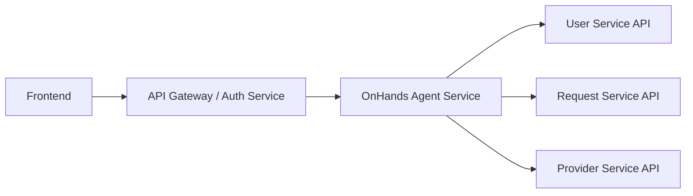
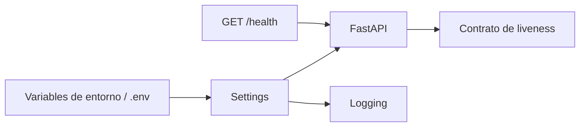

# Diagramas
## Contexto V1 previsto

```mermaid
flowchart LR
    Frontend --> Gateway[API Gateway / Auth Service]
    Gateway --> Agent[OnHands Agent Service]
    Agent --> User[User Service API]
    Agent --> Request[Request Service API]
    Agent --> Provider[Provider Service API]
```
## Foundation implementada

```mermaid
flowchart LR
    HTTP[GET /health] --> FastAPI
    FastAPI --> Health[Contrato de liveness]
    Environment[Variables de entorno / .env] --> Settings
    Settings --> FastAPI
    Settings --> Logging
```
No hay conexiones externas en Foundation.
